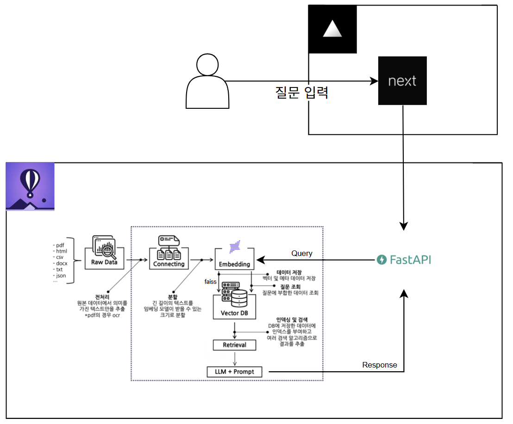

# Navisation

## 프로젝트 소개

[사이트 바로가기](https://navisation.vercel.app/)

Navisation은 여행자와 사용자를 위한 내비게이션 및 비자 정보 안내 서비스를 제공합니다. 
이 프로젝트는 Python 기반 FastAPI 백엔드와 Next.js 기반 프론트엔드로 구성되어 있습니다.

RAG(리트리벌-증강-생성) 아키텍처를 사용하여 사용자의 질문에 대한 정확하고 유용한 정보를 제공합니다.
Upstage의 Solar Pro 모델을 활용하여 비자 정보, 체류 정보 등 다양한 비자 관련 데이터를 제공합니다.

## 기능
- **비자 정보 제공**: 사용자가 입력한 국가와 비자 유형에 따라 필요한 비자 정보를 제공합니다.
- **체류 정보 안내**: 사용자가 입력한 국가와 체류 기간에 따라 필요한 체류 정보를 안내합니다.
- **사용자 친화적인 UI**: Next.js와 Tailwind CSS를 사용하여 직관적이고 반응형인 사용자 인터페이스를 제공합니다.
- **RAG 아키텍처**: FastAPI와 Upstage RAG 모델을 사용하여 사용자의 질문에 대한 정확한 답변을 제공합니다.
- **다국어 지원**: 다양한 언어로 비자 정보를 제공하여 글로벌 사용자에게 유용합니다.

## 사용법

### 1. 백엔드 실행 방법

1. Python 3.11 이상이 설치되어 있어야 합니다. (현재 3.11.9 버전 사용 중)
2. `backend` 디렉토리로 이동합니다.
3. 필요한 패키지를 설치합니다:
   ```bash
   pip install -r requirements.txt
   ```
4. 서버를 실행합니다:
   ```bash
   python main.py
   ```

### 2. 프론트엔드 실행 방법

1. Node.js 18 이상이 설치되어 있어야 합니다. (현재 22 버전 사용 중)
2. `frontend` 디렉토리로 이동합니다.
3. 필요한 패키지를 설치합니다:
   ```bash
   npm install
   ```
4. 개발 서버를 실행합니다:
   ```bash
   npm run dev
   ```

### 3. 주요 경로
- 백엔드: `backend/main.py`
- 프론트엔드: `frontend/src/app`

## 기술 스택
- **Backend**: 
  - FastAPI
  - Upstage RAG 모델 (solar pro)
  - Python 3.11
- **Frontend**:
  - Next.js
  - TypeScript
  - Tailwind CSS
- **Deployment**:
  - FrontEnd : Vercel
  - BackEnd : Fly.io

## 아키텍처 설계도

